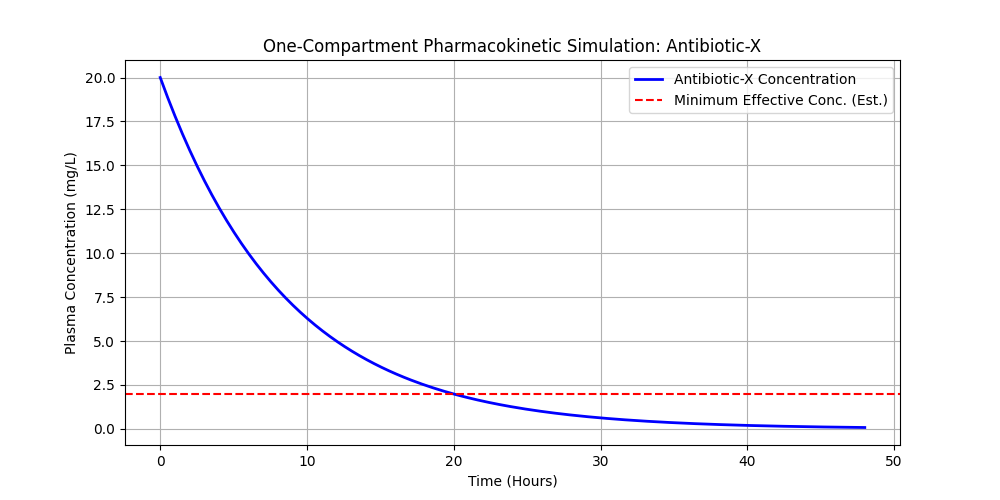

# PK-OCD-Sim
Pharmacokinetic (PK) One-Compartment Dose Simulator
# Quantitative Pharmacokinetic (PK) Compartmental Simulator

A Python-based mathematical simulation tool modeling the first-order elimination kinetics of an intravenous (IV) bolus drug administration. This project demonstrates the application of ordinary differential equations (ODEs) to clinical pharmacology parameters.

## Mathematical Framework
The model leverages a one-compartment open model governed by the equation:
C(t) = (Dose / Vd) * e^(-ke * t)

Where:
- **C(t)**: Plasma concentration at time *t*
- **Vd**: Volume of distribution
- **ke**: Elimination rate constant (ln(2) / t_1/2)

## Technologies Used
- Python 3
- NumPy (Vectorised mathematical operations)
- Matplotlib (Data visualization)

## How to Run
1. Clone the repository: `git clone https://github.com`
2. Install dependencies: `pip install numpy matplotlib`
3. Run the script: `python pk_simulator.py`

## Output Visualization

